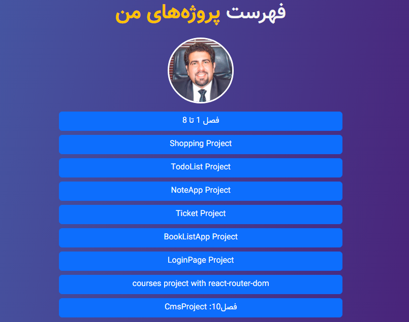

### Descriptions :

in this repository  i have collected 10 practical mini-projects in React
that designed by  **React-Boostrap**
###### version of React is 18.2.0
I hope it is useful for you 🖐️💚

#### List of Mini Projects :

- list of Practical components
- shopping card
- todolist-ticket
- NoteApp
- book List
- Login Page
- Courses List
- Dashboard Panel

### Used packages :
   -  "react": "^18.2.0",
   -  "axios": "^0.27.2",
   -  "classnames": "^2.3.1",
   -  "formik": "^2.2.9",
   -  "lodash": "^4.17.15",
   -  "prop-types": "^15.8.1",
   -  "react-bootstrap": "^2.7.4",
   -  "react-confirm-alert": "^3.0.6",
   -  "react-dom": "^18.2.0",
   -  "react-ellipsis-text": "^1.2.1",
   -  "react-helmet-async": "^1.3.0",
   -  "react-icons": "^4.8.0",
   -  "react-router-dom": "^6.3.0",
   -  "react-scripts": "5.0.1",
   -  "react-toastify": "^9.0.1",
   -  "recharts": "^2.6.2",
   -  "stylis": "^4.1.4",
   -  "stylis-plugin-rtl": "^2.0.2",
   -  "uuid": "^9.0.0",
   -  "web-vitals": "^2.1.4",
   -  "yup": "^0.32.11"
